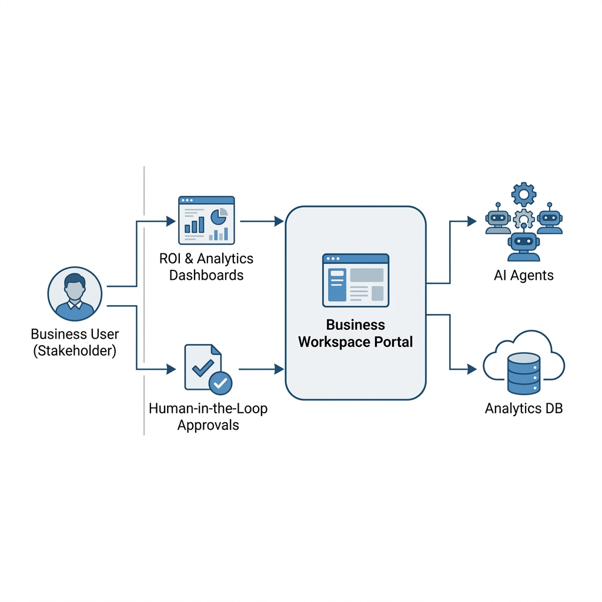
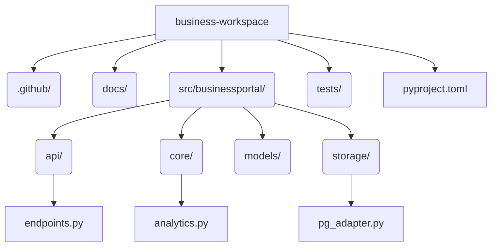

<div align="center">
  
</div>

<h1 align="center">Business Workspace Portal</h1>

<p align="center">
  <strong>ROI Analytics and Human-in-the-Loop Approvals for Non-Technical Stakeholders</strong>
</p>

---

## 1. Executive Summary

AI Agents operate autonomously, but certain high-risk actions (e.g. transferring funds, modifying production clusters) require a human sign-off. Furthermore, business leadership needs visibility into the actual Return-on-Investment (ROI) generated by these agents.

The **Business Workspace Portal** provides a dedicated, simplified backend for business analysts and managers. It allows stakeholders to view ROI dashboards (aggregated hours saved) and explicitly approve or reject agent actions via a Human-in-the-Loop (HITL) queue.

---

## 2. High-Level Design (HLD)

<div align="center">
  
  <br/>
  <em>Figure 1: The Business Workspace Portal generating local mock dependencies.</em>
</div>

### Operational Flow
1. **View ROI Analytics**: A stakeholder requests `/v1/biz/analytics/roi`. The portal calculates the aggregate `hours_saved` across all agent tasks stored in PostgreSQL and categorizes the ROI.
2. **Process HITL Approvals**: When an AI agent encounters a policy requiring human approval, the AuthZ engine pushes a task to the `hitl_queue` table. A manager can subsequently POST to `/v1/biz/approvals/{id}` to Approve or Reject the task, resolving the queue and unblocking the agent.

---

## 3. Low-Level Design (LLD)

### 3.1 Tech Stack
* **Framework**: FastAPI (Python 3.12)
* **Storage**: PostgreSQL 15 via `asyncpg`

### 3.2 Folder Architecture



### 3.3 Database Schema

| Table | Purpose |
| :--- | :--- |
| `agent_analytics` | Immutable ledger of completed tasks and `hours_saved` for ROI calculations. |
| `hitl_queue` | State machine for `Pending`, `Approve`, or `Reject` workflow decisions. |

---

## 4. API Specification

### 4.1 Fetch ROI Analytics
```bash
curl -X GET http://localhost:8001/v1/biz/analytics/roi
```
**Response**:
```json
{
  "total_tasks_completed": 12450,
  "estimated_hours_saved": 415.5,
  "roi_status": "Good"
}
```

### 4.2 Process HITL Approval
```bash
curl -X POST http://localhost:8001/v1/biz/approvals/app_12345 \
  -H "Content-Type: application/json" \
  -d '{
    "approver_id": "mgr-jane",
    "decision": "Approve",
    "reason": "Cost looks fine, proceeding."
  }'
```
**Response**:
```json
{
  "approval_id": "app_12345",
  "status": "Approve",
  "message": "Workflow successfully updated by Human-in-the-loop."
}
```

---

## 5. Quickstart

Run the Business Workspace locally:

```bash
docker-compose up -d --build
```

<hr>
<p align="center">
  <br>
  <i>Empowering stakeholders with AI transparency.</i>
  <br>
  <b><a href="https://devopstrio.com">© 2026 DevopsTrio Consulting. All rights reserved.</a></b>
</p>
